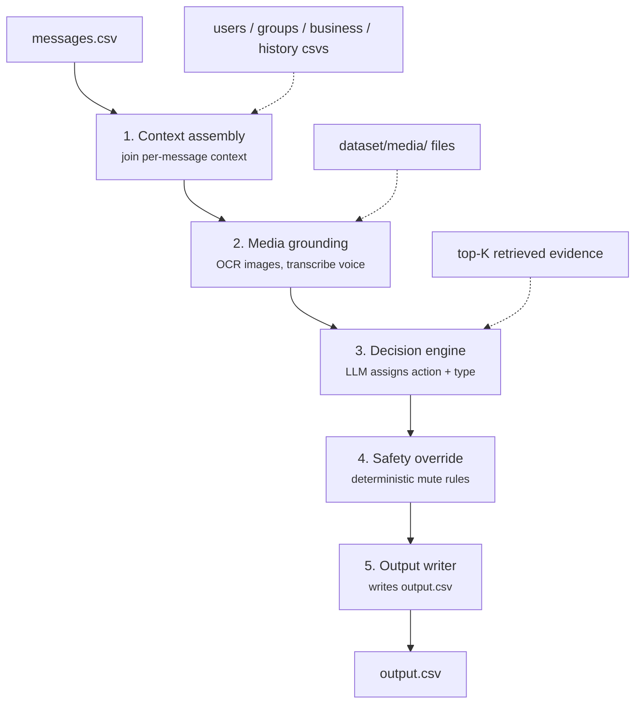

# Message Notification Router

A personalized notification router for WhatsApp, built for the HackerRank
Orchestrate 24-hour challenge.

WhatsApp delivers family chats, society notices, school updates, co-worker
messages, business promotions, image posters, voice notes, and scams into one
undifferentiated stream. This system reads each incoming message together with
the receiving user's history and relationships, and routes it to one of three
lanes:

| Action | Meaning |
|---|---|
| `notify` | Interrupt the user now |
| `digest` | Legitimate but not urgent; show later |
| `mute` | Repetitive, unwanted, low-value, or unsafe |

The same message can be routed differently for different users. A sale poster
is useful to someone who buys from that business and noise to someone who
opted out of its promotions, and the decision depends on which user received
it.

Input is `dataset/messages.csv` (110 messages: 87 text, 15 image, 8 voice).
Output is `dataset/output.csv`, one prediction per message.

Full task specification: [`problem_statement.md`](./problem_statement.md).
To run the solution: [`code/README.md`](./code/README.md).

---

## Design

A stock client pushes every message as it arrives, which produces one of two
failure modes. Push everything and the user is interrupted constantly. Batch
everything and genuinely urgent messages are buried, such as a direct mention
in a muted group or a payment reminder from a trusted admin. Neither can be
fixed by ranking content alone, because the same content warrants different
treatment for different recipients.

The router therefore classifies per message and per user, using sender
relationship, group membership and mute state, business verification status,
opt-out flags, engagement history, and media content.



| Stage | Purpose |
|---|---|
| **1. Context assembly** | Joins each message to its receiver, group, and business context. Without this the system is a content classifier, not a personalized router. |
| **2. Media grounding** | OCR for images, transcription for voice notes. A scam poster and a birthday poster are indistinguishable to a system that only sees `media_type: image`. |
| **3. Decision engine** | Weighs relationship, history, and content into one routing decision. Uses strict JSON schema output, so `action` and `message_type` are constrained to valid values by the API. |
| **4. Safety override** | Deterministic rules that can only tighten toward `mute` or lower confidence, never loosen. Also filters hallucinated `evidence_message_ids` against real history. |
| **5. Output writer** | Writes `output.csv` in the required column and row order. |

Context and media grounding run first because the decision cannot be made
without them. The safety layer runs after the model rather than inside it, so
that safety-critical behavior is one auditable deterministic pass rather than
a property the model has to get right on every call.

The safety layer uses three rules, each requiring a field combination rather
than a single signal: a prior report from this sender by this user; an
unverified business sending from a domain that does not match its official
one; and an explicit promotions opt-out on a message classified as a
promotion. Rationale and the data audit behind each threshold are in
[`docs/02-approach.md`](./docs/02-approach.md).

---

## Results

Measured on the 30 solved rows in `dataset/sample_messages.csv`, and on the
full 110-row run.

| Metric | Result |
|---|---|
| Action accuracy | 86.7–90.0% |
| Message type accuracy | 73.3–80.0% |
| Evidence retrieval recall | 96.8% (30 of 31 expected IDs) |
| Rows completed without fallback | 110 / 110 |
| Rows with a distinct `reason` string | 110 / 110 |
| Rows citing validated historical evidence | 102 / 110 |

Accuracy is reported as a range because `gpt-4o-mini` at `temperature=0` is
not perfectly deterministic under structured output. Repeat runs vary within
the bands above.

### Limitations

Three things a reviewer should know:

**Digest is under-predicted.** The full run produced 48.2% `mute`, 37.3%
`notify`, and 14.5% `digest`, against a sample-set distribution of 33.3% /
30.0% / 36.7%. This is the digest-into-mute collapse described in
[`docs/tasks.md`](./docs/tasks.md), which prompt rule 8 was written to correct
and partially did. Either the bias persists at full-dataset scale, or the
30-row sample is not distributionally representative of the 110 real rows.
Nothing in the available data distinguishes the two, so it was left uncorrected
rather than tuned toward a 30-row target.

**The evaluation basis is small.** All accuracy figures rest on 30 solved
examples. Past a point, tuning against them fits noise rather than the task.
One persistently misclassified sample row was left alone for this reason.

**Model defaults are floating aliases.** `gpt-4o-mini` and `whisper-1` can be
repointed by the provider, which would change behavior with no change to this
code. Pinning dated snapshots is a one-line environment change and is
recommended for any long-lived deployment.

---

## Repository layout

```text
.
├── README.md
├── problem_statement.md              # Full challenge specification
├── AGENTS.md                         # Conventions + transcript logging for AI coding tools
├── code/
│   ├── README.md                     # Setup, environment variables, run instructions
│   ├── requirements.txt
│   ├── main.py                       # Entry point
│   ├── pipeline/                     # The five stages above
│   ├── scripts/                      # Per-phase validation scripts
│   └── cache/                        # Committed OCR/ASR results, keyed by media_id
├── docs/
│   ├── 01-PRD.md                     # Requirements, non-goals, success metrics, risks
│   ├── 02-approach.md                # Design rationale, alternatives considered
│   ├── 03-delivery-plan.md           # Hour-by-hour plan for the 24h window
│   ├── tasks.md                      # Build log and running checklist
│   └── production-considerations.md  # Extending, deploying, scaling, failure modes
└── dataset/
    ├── messages.csv                  # Messages to route
    ├── output.csv                    # Predictions produced by this system
    ├── sample_messages.csv           # Solved examples used for evaluation
    ├── users.csv                     # User notification behavior
    ├── groups.csv                    # Group metadata
    ├── group_members.csv             # User-group relationships
    ├── business_accounts.csv         # Business sender metadata
    ├── user_business_history.csv     # User-business relationship history
    ├── message_history.csv           # Historical messages
    ├── message_events.csv            # User reactions to historical messages
    ├── images.csv                    # Image IDs and media file paths
    ├── voice_notes.csv               # Voice note IDs and media file paths
    ├── daily_notification_summary.csv
    └── media/
        ├── images/
        └── audio/
```

---

## Output format

One row per `message_id` in `dataset/messages.csv`:

| Column | Contents |
|---|---|
| `message_id` | Incoming message ID |
| `action` | `notify`, `digest`, or `mute` |
| `message_type` | Best-fit category (`personal`, `urgent`, `event`, `payment`, `business_update`, `promotion`, `greeting`, `forward`, `spam`, `scam`, `unknown`) |
| `reason` | Short explanation naming the specific signal and subject |
| `confidence` | Float in `[0, 1]` |
| `evidence_message_ids` | Semicolon-separated historical IDs, or `none` |

Structural validity is enforced by `code/scripts/spotcheck_phase8.py`, which
checks row count, column order, blank fields, confidence range, and that every
cited evidence ID resolves to a real historical message belonging to that
row's user.

---

## Verification

Each build phase has a standalone validation script under `code/scripts/`.
Several are fully deterministic and need no API key. See
[`code/README.md`](./code/README.md) for what each covers and how to run them.

The solution reads only the participant-facing files in `dataset/`, uses no
organizer-only data or hardcoded labels, and reads all credentials from
environment variables.

---

## Submission artifacts

1. `code.zip` — runnable solution, prompts, configuration, READMEs, validation scripts
2. `dataset/output.csv` — predictions for all 110 messages
3. `log.txt` — session transcript, written to `$HOME/hackerrank_orchestrate_august26/log.txt`
   (`%USERPROFILE%\hackerrank_orchestrate_august26\log.txt` on Windows) per
   [`AGENTS.md`](./AGENTS.md)
