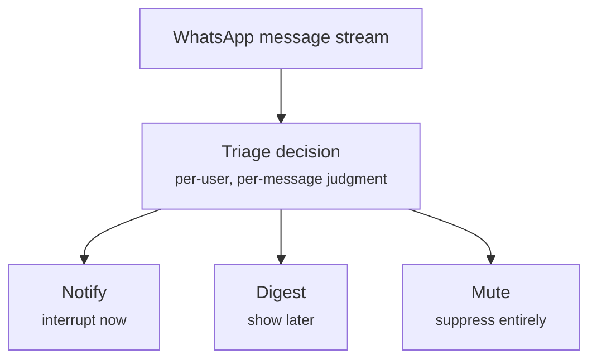

# HackerRank Orchestrate

Starter repository for the **HackerRank Orchestrate** 24-hour hackathon.

## Message Notification Router

Build an AI-powered system for WhatsApp that decides which messages deserve immediate attention, which should wait, and which should be muted.

The system must reason over multimodal messages, including text messages, image posters/screenshots, and voice notes.

WhatsApp is noisy. A user can receive family chats, society notices, school updates, co-worker messages, business account promotions, image posters, voice notes, and scams in the same message stream. Treating every message the same creates two bad outcomes: important messages get missed, and unwanted or risky messages interrupt the user.

Read [`problem_statement.md`](./problem_statement.md) for the full task spec, input/output schema, allowed values, and submission format.

---

## Architecture: it's a triage queue

A stock WhatsApp client is already a queue — every message lands and gets pushed. That's a **FIFO, push-everything queue**, and it's exactly the failure mode above: treat every message the same and you either interrupt people constantly, or if you swing the other way and batch everything, you miss the one message that actually mattered (a scam, a direct mention in a muted group, a genuinely urgent work message).

What this repo asks you to build is a **triage queue**: the same messages come in, but each one gets classified per-user before it's routed to one of three lanes.



Why not simpler alternatives?

- **Push everything (FIFO)** — no concept of "this can wait", so the user gets interrupted constantly.
- **Always batch (digest-only)** — loses real urgency, e.g. a direct mention in a muted group or a legitimate payment reminder from a trusted admin gets buried with everything else.

So the triage decision has to happen per message, per user, using more than just the message text. That decision is computed by a five-stage pipeline:


Why each stage is load-bearing, working backward from what breaks without it:

| Stage | Why it exists | What breaks if you skip it |
|---|---|---|
| **1. Context assembly** | Triage without personalization is just content classification. A sale poster can be useful to one user and noise to another — you can only tell by knowing *this* user's relationship to *this* sender/group/business (mute state, past engagement, opt-in/opt-out). | You end up building a generic spam filter, not a personalized router. |
| **2. Media grounding** | The queue is multimodal — you can't triage what you can't read. Images and voice notes need OCR/ASR before they're reasoned about. | Every media message gets the same default treatment regardless of content (dangerous — a scam poster and a birthday poster look identical to a system that only sees `media_type: image`). |
| **3. Decision engine** | This is the triage box itself — the one place sender relationship, history, and content actually get weighed together into notify / digest / mute. | Without it there's no decision at all — everything upstream is just data prep. |
| **4. Safety override** | Triage mistakes aren't equal cost. Misrouting a birthday message is mildly annoying; misrouting a scam to `notify` (or a legitimate message to `mute` because of a false-positive scam signal) is a bad tradeoff to leave entirely to one probabilistic LLM pass. This layer is deterministic and can only tighten toward mute, never loosen — it's also where hallucinated `evidence_message_ids` get filtered against real history. | Safety-critical correctness depends entirely on the LLM getting it right on the first pass, every time. |
| **5. Output writer** | A routing decision that isn't recorded isn't a decision — it has to land in `output.csv`, row per row, to be graded. | No way to reproduce or evaluate what the system decided. |

Order matters too: context and media come first because you can't classify what you don't understand; safety runs *after* the decision because it's simpler to have one override layer inspect the final call than to duplicate safety logic across every reasoning branch.

Companion docs for the full build plan (requirements, design rationale, hour-by-hour schedule, and a live task checklist):

- `01-PRD.md` — requirements (FR-numbered), non-goals, success metrics, risks
- `02-approach.md` — this architecture in more detail, alternatives rejected, revisit triggers
- `03-delivery-plan.md` — hour-by-hour plan for the 24h window
- `tasks.md` — live checklist to track progress across sessions

---

## Repository Layout

```text
.
├── AGENTS.md                         # Rules for AI coding tools + transcript logging
├── problem_statement.md              # Full challenge statement
├── README.md                         # You are here
├── 01-PRD.md                         # Requirements
├── 02-approach.md                    # Architecture / design rationale
├── 03-delivery-plan.md               # 24h hour-by-hour plan
├── tasks.md                          # Live task checklist
└── dataset/
    ├── messages.csv                  # Messages to route
    ├── output.csv                    # Blank submission template
    ├── sample_messages.csv           # Solved examples
    ├── users.csv                     # User notification behavior
    ├── groups.csv                    # Group metadata
    ├── group_members.csv             # User-group relationships
    ├── business_accounts.csv         # Business sender metadata
    ├── user_business_history.csv     # User-business history
    ├── message_history.csv           # Historical messages
    ├── message_events.csv            # User reactions to historical messages
    ├── images.csv                    # Image IDs and media file paths
    ├── voice_notes.csv               # Voice note IDs and media file paths
    ├── daily_notification_summary.csv
    └── media/
        ├── images/
        └── audio/
```

---

## What You Need to Build

For every row in `dataset/messages.csv`, produce one row in `output.csv` with:

| Column | Meaning |
|---|---|
| `message_id` | Incoming message ID |
| `action` | One of `notify`, `digest`, or `mute` |
| `message_type` | Best-fit message category |
| `reason` | Short human-readable explanation |
| `confidence` | Number from `0` to `1` |
| `evidence_message_ids` | Historical message IDs used as evidence; write `none` if there is no useful evidence |

Your system should make personalized decisions using the provided message, user, group, business, media, and historical interaction data.
For image and voice-note messages, `images.csv` and `voice_notes.csv` only provide file paths; your system should inspect the media files themselves.

---

## Suggested Workflow

1. Inspect `dataset/sample_messages.csv` to understand the expected output format.
2. Load `dataset/messages.csv` and all relevant context files.
3. Build your routing system using any approach: LLMs, retrieval, rules, classifiers, agents, or hybrids.
4. Write predictions to `output.csv`.
5. Evaluate your approach on the solved sample rows before submitting.

You may use any language or runtime. Python, JavaScript, and TypeScript are all reasonable choices.

---

## Requirements

Your solution must:

- be runnable from the terminal
- read the provided files from `dataset/`
- produce a valid `output.csv`
- include one prediction for every `message_id` in `dataset/messages.csv`
- not use organizer-only files or hardcoded labels

If you use API keys or secrets, read them from environment variables. Never hardcode secrets in the repo.

---

## Evaluation

Your `output.csv` will be compared against hidden ground-truth labels.

The scoring will consider:

- correctness of `action`
- correctness of `message_type`
- usefulness and consistency of `reason`
- whether `evidence_message_ids` point to relevant historical messages
- reasonable confidence calibration

Strong systems will combine retrieval, structured metadata, behavioral history, safety checks, OCR/ASR handling, and contextual reasoning.

---

## Chat Transcript Logging

This repo includes an [`AGENTS.md`](./AGENTS.md) file for AI coding tools. It asks compatible tools to append conversation summaries to:

| Platform | Path |
|---|---|
| macOS / Linux | `$HOME/hackerrank_orchestrate_august26/log.txt` |
| Windows | `%USERPROFILE%\hackerrank_orchestrate_august26\log.txt` |

Upload this log as your chat transcript at submission time. Do not paste secrets into the chat.

---

## Submission

Submit the following files as instructed by HackerRank:

1. **Code zip**: full runnable solution, prompts/configs, README, and any evaluation files.
2. **Predictions CSV**: final `output.csv` for all rows in `dataset/messages.csv`.
3. **Chat transcript**: the `log.txt` described above.

Before submitting, confirm:

- `output.csv` has one row per row in `dataset/messages.csv`.
- `output.csv` has the exact required columns in the exact required order.
- Your runnable code and setup instructions are included in `code.zip`.